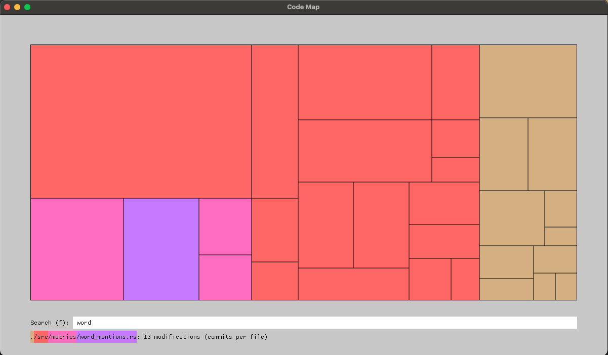
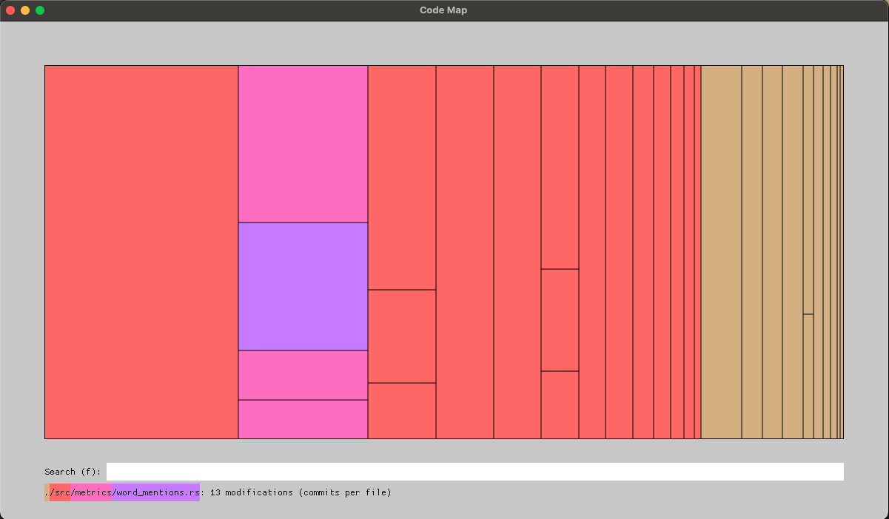

# code-map

## Running this project

You can download a pre-compiled binary for Mac from https://s3.console.aws.amazon.com/s3/buckets/intrasonics-releases?prefix=code-map/&region=eu-west-1

You can also clone this repo, then [Install rust](https://www.rust-lang.org/tools/install), then do `cargo run --release`.

If you cloned the repo, you can install the binary in your PATH with `cargo install --path .`, and then you can do `code-map` from anywhere. Run `code-map --help` for the available options.

## Metrics 

You can choose different metrics to plot. Each metric assigns a number to each node in a tree. The tree, nodes and metrics can be computed from different sources, but the most common use case is to compute them from a directory tree, where each node is a directory or a file.

### Bytes per file

`code-map --metric bytes-per-file` or `code-map -m b`

With this metric, each leaf node is a file, and the size of the node is the size of the file. Directories are non-leaf nodes and their metric is the sum of bytes of all their children.

All files are considered, including files ignored by git and files with unknown extensions.

### Lines per file

`code-map --metric lines-per-file` or `code-map -m l`

With this metric, each leaf node is a file, and the size of the node is the number of lines in the file. Directories are non-leaf nodes and their metric is the sum of lines of all their children.

Only files with known extensions for source code are considered. Files with unknown extensions are ignored.
Files ignored by git are also considered.

### Churn per file

`code-map --metric churn-per-file` or `code-map -m c`

With this metric, each leaf node is a file, and the size of the node is the number of commits that touched the file. Directories are non-leaf nodes and their metric is the sum of churn of all their children.

You can get the churn from the command line with this command:
```
git log --all -M -C --name-only --format='format:' "$@" | grep -v '^$' | sort | uniq -c | sort -n
```

This is not a stable implementation and may miscount the number of commits in case of file renames. A file that was renamed from `old/path/file.txt` to `new/path/file.txt` may be rendered twice.

Only files in the git repo are considered (the .gitignore file is respected), but these files can be of any file extension.

## Arrangements

Different ways of plotting the hierarchical data are available.

### Binary



This arrangement attempts to solve the shortcomings of the linear arrangement. Given a node with sub-nodes to be plotted in a rectangle, it will sort the sub-nodes (biggest first) and then split them in 2 groups, so that the metrics sum of each group is roughly half the parent node.

It will not produce optimal squareness, but it will be better than the linear arrangement.

### Linear



This arrangement is quite simple. Given a node with sub-nodes to be plotted in a rectangle, it will plot the sub-nodes along the longest side of the rectangle, sorted by size, biggest first.

Each sub-node will arrange their own sub-sub-nodes in the same way.

This arrangement is not great when a node has many children. The children will be plotted as very thin lines.


## Roadmap

- UI
  - [/] be able to click on a box and highlight only the parents (like click, backspace, backspace, enter)
    - [x] right click to remove selection
  - [x] box to search for a file (substring)
    - [ ] fuzzy search
    - [ ] allow upper case letters in search
  - [/] other arrangements that don't draw very thin lines
  - [ ] zoom in
  - [x] clicking on the same path removes the level selection
- cli/logs
  - [x] -a --arrangement 
  - [x] -m --metric (file size, line count, code complexity, etc.)
    - [x] --metric churn (`cargo run --example git_churn` for the data without the UI)
      - [ ] allow processing only the last x commits
    - [ ] --metric refactor (churn * line count)
  - [x] -x --all-file-extensions
  - [ ] -i --input-file (read counts from a file / stdin / sql dump)
  - [ ] -o --output-file (dump the hierarchical metrics to a file, as some metrics might be expensive to compute, e.g. code complexity)
  - [ ] aggregate counts of ignored files/extensions
      - [ ] list them with --verbose
  - [ ] --include-extensions
