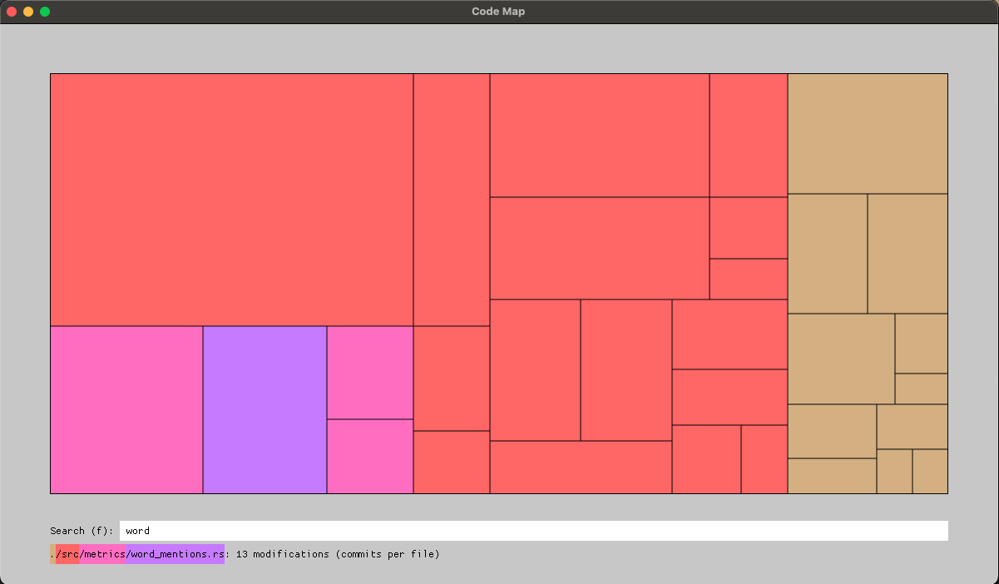
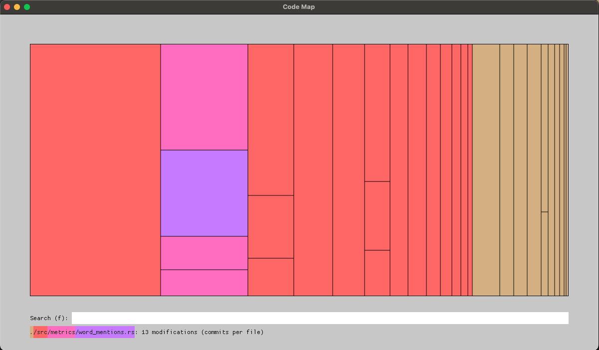

# code-map

Run `code-map` in your git repo to get an interactive visualization of which files have been modified more often,
or which are the biggest files.

IMO visualizing commits per file is very useful when you are faced with a new repo,
because I claim that the files with more commits are either the places you'll need to modify for a new feature,
or files which have tech debt, and getting to know those files is useful to get up to speed with the new repo.

If you think of the opposite, good extensible code doesn't get modified often.
This project probably doesn't help finding those good pieces of code, though.

You can also visualise other metrics like file size or lines per file, even in non-git folders.
For example if you want to free space in your disk,
this tool will help you find which are the biggest folders and files,
and from those you can delete the ones you don't need.
By [Amdahl's law](https://en.wikipedia.org/wiki/Amdahl%27s_law),
the first files you delete this way will make the most impact freeing up space.

Note that running this tool on your whole disk might be slow.
In my 360 GB SSD partition it takes ~23 seconds to read all file sizes,
and it might be even slower if the disk is cold.
After that, the tool should be fast enough to still be interactive.

## Running this project

You can clone this repo, then [Install rust](https://www.rust-lang.org/tools/install), then do `cargo run --release -- --help`.

I suggest installing the binary in your PATH with `cargo install --path .`,
and then you can do `code-map --help` from anywhere.

### Example usages

- commits per file in the current directory: `code-map`
- bytes per file in the current directory: `code-map --metric bytes-per-file` or `code-map -m b`
- commits per file in some directory: `code-map ~/some/dir`

See all available options with `code-map --help`.


### Searching

In the main screen, you can search for a file by typing a substring in the search box.
Click on the box or press 'f' to start searching.
The search is case-insensitive and fuzzy, so you can type `config man` to find `ConfigurationManager`.
From the dropdown you can only select the first entry, selecting others or moving the cursor is not implemented.

## Metrics

You can choose different metrics to plot.
Each metric assigns a number to each node in a tree.
The tree, nodes and metrics can be computed from different sources,
but the most common use case is to compute them from a directory tree,
where each node is a directory or a file.

### Bytes per file

`code-map --metric bytes-per-file` or `code-map -m b`

With this metric, each leaf node is a file, and the size of the node is the size of the file. Directories are non-leaf nodes and their metric is the sum of bytes of all their children.

All files are considered, including files ignored by git and files with unknown extensions.

### Lines per file

`code-map --metric lines-per-file` or `code-map -m l`

With this metric, each leaf node is a file, and the size of the node is the number of lines in the file. Directories are non-leaf nodes and their metric is the sum of lines of all their children.

Only files with known extensions for source code are considered. Files with unknown extensions are ignored.
Files ignored by git are also considered.

### Churn per file

`code-map --metric churn-per-file` or `code-map -m c`

With this metric, each leaf node is a file, and the size of the node is the number of commits that touched the file. Directories are non-leaf nodes and their metric is the sum of churn of all their children.

You can get the churn from the command line with this command:
```
git log --all -M -C --name-only --format='format:' "$@" | grep -v '^$' | sort | uniq -c | sort -n
```

This is not a stable implementation and may miscount the number of commits in case of file renames. A file that was renamed from `old/path/file.txt` to `new/path/file.txt` may be rendered twice.

Only files in the git repo are considered (the .gitignore file is respected), but these files can be of any file extension.

If the repo has many thousands of old commits you don't care about, you can limit how many of the most recent commits are considered with the `--max-commits` option.

## Arrangements

Different ways of plotting the hierarchical data are available.

### Binary



This arrangement attempts to solve the shortcomings of the linear arrangement. Given a node with sub-nodes to be plotted in a rectangle, it will sort the sub-nodes (biggest first) and then split them in 2 groups, so that the metrics sum of each group is roughly half the parent node.

It will not produce optimal squareness, but it will be better than the linear arrangement.

### Linear



This arrangement is quite simple. Given a node with sub-nodes to be plotted in a rectangle, it will plot the sub-nodes along the longest side of the rectangle, sorted by size, biggest first.

Each sub-node will arrange their own sub-sub-nodes in the same way.

This arrangement is not great when a node has many children. The children will be plotted as very thin lines.

### Golden

Manually tweaked version of the binary arrangement.
It tries to maximize squareness by using an empirically chosen ratio of how many items to put in the first division of a bigger rectangle.
It might be worse than binary on some datasets.

## Roadmap

- UI
  - [x] be able to click on a box and highlight only the parents (like click a box, and click on the name of a parent)
    - [x] click the same box or right click in the tree map to remove selection
  - [x] box to search for a file (substring)
    - [x] fuzzy search
    - [ ] allow upper case letters in search
    - [ ] allow using arrows or clicks to select any entry other than the first one
  - [x] other arrangements that don't draw very thin lines
  - [ ] zoom in
  - [x] clicking on the same path removes the level selection
- cli/logs
  - [x] -a --arrangement 
  - [x] -m --metric (file size, line count, code complexity, etc.)
    - [x] --metric churn (`cargo run --example git_churn` for the data without the UI)
      - [x] allow processing only the last x commits
    - [ ] --metric refactor (churn * line count)
  - [x] -x --all-file-extensions
  - [ ] -i --input-file (read counts from a file / stdin / sql dump)
  - [ ] -o --output-file (dump the hierarchical metrics to a file, as some metrics might be expensive to compute, e.g. code complexity)
  - [ ] aggregate counts of ignored files/extensions
      - [ ] list them with --verbose
  - [ ] --include-extensions
  - [x] refresh computed metrics (e.g. you deleted some files)
  - [x] copy path to clipboard
